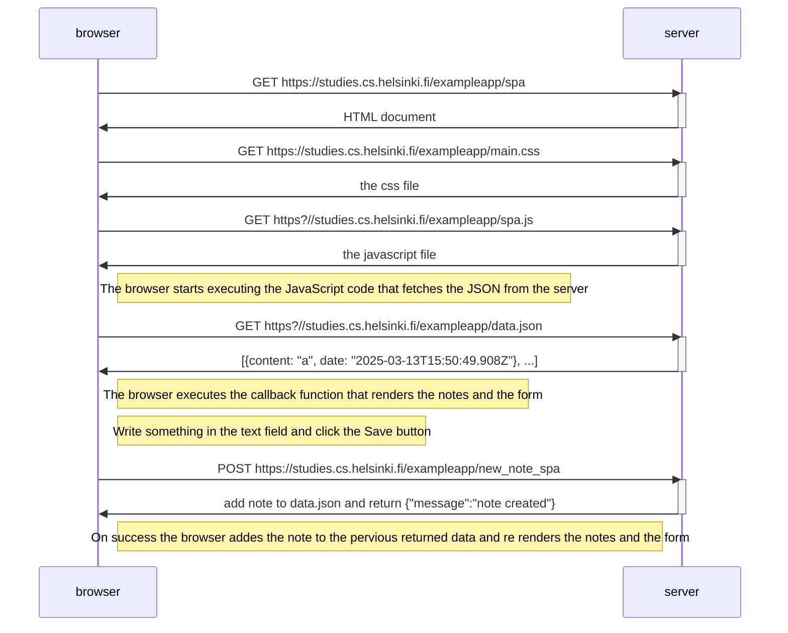

```mermaid
sequenceDiagram
  participant browser
  participant server

  browser->>server: GET https://studies.cs.helsinki.fi/exampleapp/spa
  activate server
  server->>browser: HTML document
  deactivate server

  browser->>server: GET https://studies.cs.helsinki.fi/exampleapp/main.css
  activate server
  server->>browser: the css file
  deactivate server

  browser->>server: GET https?//studies.cs.helsinki.fi/exampleapp/spa.js
  activate server
  server->>browser: the javascript file
  deactivate server

  Note right of browser: The browser starts executing the JavaScript code that fetches the JSON from the server

  browser->>server: GET https?//studies.cs.helsinki.fi/exampleapp/data.json
  activate server
  server->>browser: [{content: "a", date: "2025-03-13T15:50:49.908Z"}, ...]
  deactivate server

  Note right of browser: The browser executes the callback function that renders the notes and the form
  Note right of browser: Write something in the text field and click the Save button

  browser->>server: POST https://studies.cs.helsinki.fi/exampleapp/new_note_spa
  activate server
  server->>browser: add note to data.json and return {"message":"note created"} 
  deactivate server

  Note right of browser: On success the browser addes the note to the pervious returned data and re renders the notes and the form
```
